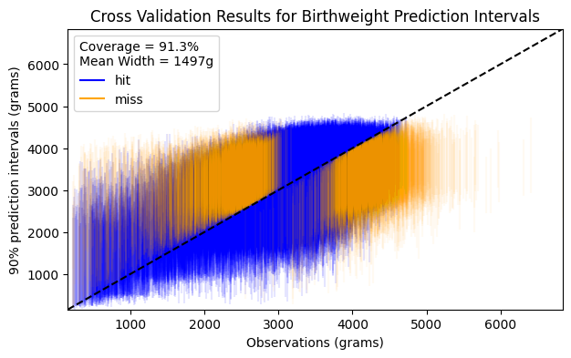

# Prediction interval competition I: Birth weight

**Author**: Hunter Merrill



## Overview

This repo contains code for the [birth weight prediction interval Kaggle competition](https://www.kaggle.com/competitions/prediction-interval-competition-i-birth-weight/overview). A python package and a command line interface (CLI) are available for data processing, model training, and cross-validating prediction intervals of birth weights. Functionality is also available for tuning the hyperparameters of the tree-based and neural network models.

## Implemented models

The following models are implemented in this package:

1. Simple L2-regularized linear regression (i.e., ridge regression)
2. Tree-based models:
   - [Wildwood](https://wildwood.readthedocs.io/en/latest/index.html), an extension of random forests in which predictions come from ensembling all possible subtrees
   - Histogram-based gradient boosting
3. Neural network models:
   - A regressor that fits the four-parameter sinh-arcsinh distribution to the data (optionally Bayesian)
   - A classifier that predicts binned birthweights
   - An interval predictor based on [Expanded Interval Minimalization](https://arxiv.org/abs/1806.11222)
4. Ensemblers:
   - Histogram-based gradient boosting
   - The sinh-arcsinh neural network described above.

Many of these models use [Mapie](https://mapie.readthedocs.io/en/latest/) in a post-processing step to calibrate the predicted intervals. For each model, predictions on the kaggle test set are made by ensembling predictions from each trained model in the cross-validation process on the training set in order to reduce overfitting. The predictors in the ensemblers consist of the original feature set in addition to predictions from the models. The predictions from the models used as predictors in the ensembler are made on left-out folds to avoid data leakage caused by training on the same data twice. A final set of "hail mary" ensemblers are implemented to ensemble the models and ensembles together. The original feature set is excluded from this second-level ensembling. There is data leakage in this final set of ensemblers (and, as expected, they overfit).

## Data processing

For the regression and neural network models, categorical variables are one-hot encoded. The tree-based models use an integer-encoding and have native categorical support. The regression model uses means and modes to impute missing data. The tree-based models have native support for missingness, and the neural networks handle missingness in the first hidden layer based on methods from [this paper](https://arxiv.org/pdf/1805.07405.pdf). To avoid extrapolation issues, the linear and neural network models use log-transformed features for a subset of features that exhibit heavy skew. The target variable for the neural networks is the inverse-softplus-transformed birthweight, so that at prediction time, prediction intervals are bounded below by zero (since it is impossible for birthweight to be negative).

## Usage

The package can be installed as usual via `pip` or `poetry`.

### Python API

The data processor is useful for preparing data for each type of model:

```python
from kaggle_prediction_interval_birthweight.data.data_processing import DataProcessor

data_processor = DataProcessor("WildWoodRegressor")
X, y = data_processor(df)
```

The model classes listed [here](https://github.com/hrmerrill/kaggle-prediction-interval-birthweight/blob/main/kaggle_prediction_interval_birthweight/model/__init__.py#L14-L23) can be imported and used as follows:

```python
from kaggle_prediction_interval_birthweight.model import WildWoodRegressor

wildwood_regressor = WildWoodRegressor()
wildwood_regressor.fit(X, y)
```

The `Validator` class is available for cross-validation as well as ensembling predictions from the models trained on each fold:

```python
from kaggle_prediction_interval_birthweight.workflow.validation import Validator

validator = Validator("NeuralNetEnsembler")
validator.fit(train_df)
validator.print_performance_summary()

lower, upper = validator.predict_intervals(test_df)
```

### CLI

The CLI wraps much of this functionality into convenient command line tools.

```bash
# to create a submission for a single model
kaggle-prediction-interval-birthweight create-submission HistBoostEnsembler

# to create the final "hail mary" submissions
kaggle-prediction-interval-birthweight create-hail-mary-submission
```

### Make commands

A Makefile is also provided to provide even more convenience to developers.

```bash
# this formats and lints code, updates dependencies and builds the package, and commits changes to git
make firedrill

# this creates submissions from all methods in this codebase
make run
```